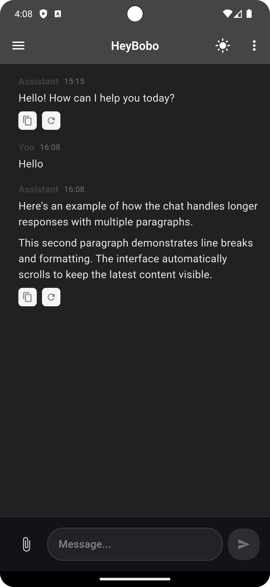
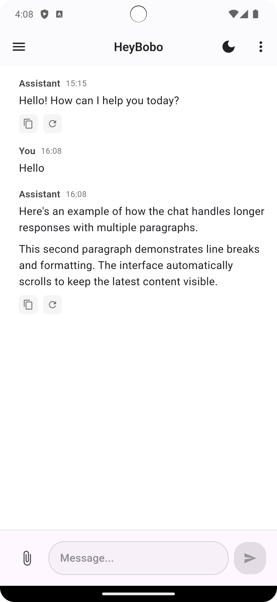
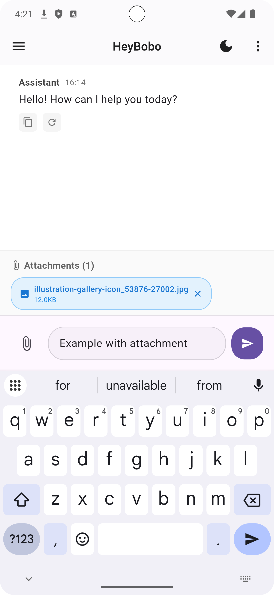

# HeyBobo Chat UI

A ChatGPT-inspired chat application built with Flutter, featuring real-time streaming responses, file attachments, and markdown support.

## ✨ Features

- **Real-time Streaming Messages** - AI responses stream in word by word
- **File Attachments** - Support for documents, images, videos, and audio files
- **Markdown Support** - Rich text formatting with code highlighting
- **Message Actions** - Copy messages and regenerate AI responses
- **Clean Material UI** - Modern, responsive design
- **Error Handling** - User-friendly error messages and recovery

## 📱 Screenshots

<div align="center">
  
  
  
  
</div>

## 🏗️ Project Structure

```
lib/
├── main.dart                    # App entry point
├── models/
│   └── chat_message.dart       # Message and attachment models
│   └── conversation_history.dart #Conversation History
├── controllers/
│   └── chat_controller.dart    # Chat logic and state management
│   └── theme_controller.dart   # Theme Controller
├── services/
│   └── chat_service.dart       # Mock AI service
├── views/
│   └── chat_view.dart          # Main chat screen
└── widgets/
    ├── message_list.dart       # Message list view
    ├── message_bubble.dart     # Individual message bubble
    ├── message_input.dart      # Message input field
    └── attachment_preview.dart # File attachment preview
```

## 🚀 Getting Started

### Prerequisites

- Flutter SDK (>=3.0.0)
- Dart SDK (>=3.0.0)

### Installation

1. **Clone the repository**

   ```bash
   git clone https://github.com/nadeemahmed2602/Heybobo-Task.git
   cd flutter-chat-ui
   ```

2. **Install dependencies**

   ```bash
   flutter pub get
   ```

3. **Run the app**
   ```bash
   flutter run
   ```

## 📦 Dependencies

```yaml
dependencies:
  flutter:
    sdk: flutter
  file_picker: ^6.1.1 # File selection
  flutter_markdown: ^0.6.18 # Markdown rendering
  image_picker: ^1.0.4 #Image selection

dev_dependencies:
  flutter_test:
    sdk: flutter
  flutter_lints: ^3.0.0
```

## 🎯 Key Components

### 1. **ChatController**

Manages chat state, message handling, and file attachments:

- Send messages with streaming responses
- Handle file attachments
- Copy and regenerate messages
- Auto-scroll to latest message

### 2. **ChatService**

Mock AI service that simulates streaming responses:

- Word-by-word streaming simulation
- Multiple response templates
- Realistic typing delays

### 3. **MessageBubble**

Individual message component with:

- User/Assistant avatars
- Timestamp display
- Markdown content rendering
- Action buttons (copy, regenerate)
- File attachment display

### 4. **MessageInput**

Advanced input field featuring:

- Multi-line text input
- File attachment button
- Send button with state management
- Auto-resize capability
